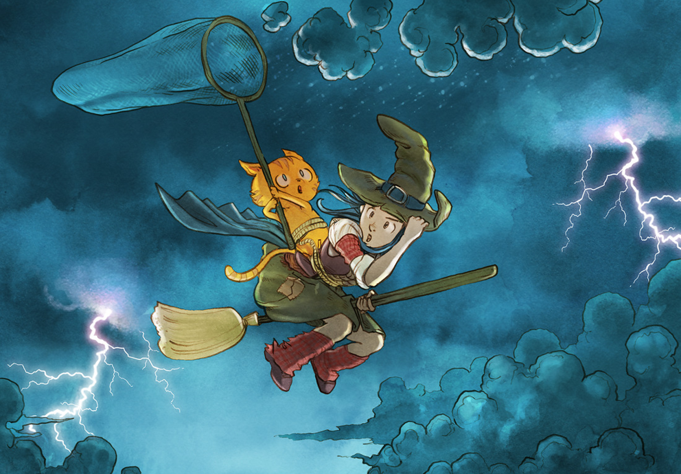

# Pepper&Carrot translation project
# Episode 03 : The secret ingredient

[http://www.peppercarrot.com](http://www.peppercarrot.com)

License
=======

[Creative Commons Attribution 3.0](https://creativecommons.org/licenses/by/3.0/)

## Translators and correctors :

* Dutch      : Willem Sonke

* English    : David Revoy, Amireti

* French     : David Revoy

* German     : Helmar Suschka / Alexandra Jordan

* Greek      : Dimitris Axiotis

* Italian    : Carlo Gandolfi

* Japanese   : guruguru

* Polish     : Przemysław "Kev" Chudzia

* Portuguese : Frederico Batista

* Russian    : Denis "uncle Night" Prisukhin

* Sinhala    : Tharinda Divakara

* Spanish    : TheFaico

* Ukrainian  : Leonid "Deburger" Androschuk

## Fonts:

* Lavi by Ruben Holthuijsen aka Rholt
[GNU GPL V3](http://www.gnu.org/copyleft/gpl.html), [link](http://www.dafont.com/lavi.font)

* Robokoz  by Ray Larabie, rlarabie@hotmail.com
[CC-0 / Public Domain], [link](http://dafont.me/view_file/175/UmVhZF9NZS50eHQ=/read_me.txt)

* Blogger by Sergiy S. Tkachenko
[CC-BY](http://creativecommons.org/licenses/by/3.0/), [link](http://openfontlibrary.org/en/font/blogger-sans)

* Pecita by OFL user Pecita
[OFL (SIL Open Font Licence)](scripts.sil.org/OFL), [link](http://openfontlibrary.org/font/pecita)

* VAG-HandWritten by Vangelis Makridakis
[GNU GPL V2](http://www.fontsquirrel.com/license/VAG-HandWritten), [link](http://www.fontsquirrel.com/fonts/VAG-HandWritten)

* Rounded-mplus-1c-medium.ttf from Rounded M+ by MM
[MFont+ license]　(http://jikasei.me/font/rounded-mplus/license.html), [link] (http://jikasei.me/font/rounded-mplus/about.html)

* Bashita Complex Bold by the ICT Agency (ICTA) of Sri Lanka
[Creative Commons Attribution](https://creativecommons.org/licenses/by/3.0/), [link](http://www.icta.lk/index.php?option=com_content&view=article&id=1497:sinhala-tamil-unicode-fonts-bhashitha-and-sritamil&catid=104&Itemid=234&lang=en)

* Neucha by [Jovanny Lemonad](https://plus.google.com/115426726897976242009/about), [SIL Open Font License](http://scripts.sil.org/OFL), [link](https://www.google.com/fonts/specimen/Neucha)

* Gabriela by Eduardo Tunni, [SIL Open Font License](http://scripts.sil.org/OFL), [link](http://www.fontspace.com/eduardo-tunni/gabriela)

## Artworks :

* David Revoy, www.peppercarrot.com

Infos :
=======

- Translation/Correction [full how-to documentation](http://www.peppercarrot.com/fr/article267/how-to-add-a-translation-or-a-correction)

- Ressources added in this project must be compatible with the CC-By license ( fonts, images, etc ). Are compatible : Public domain fonts, GNU/GPL fonts, CC-0 fonts, CC-BY fonts, SIL Open Font License (OFL). Adding author name plus a link and license is appreciated.

- Do not edit or propose a commit for the artworks in this repositories. Artworks here are low-resolution proxy files only. The real hi-res layered artworks,  *.kra files, are [available here] www.peppercarrot.com/static6/sources.
